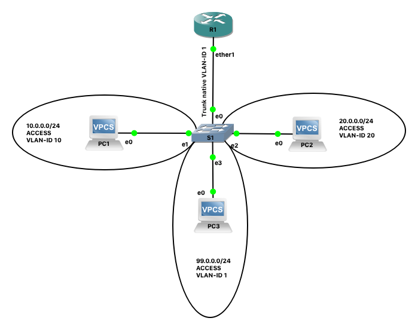

= Mikrotik
Rudi Swennen
:doctype: article
:encoding: utf-8
:lang: nl
:toc: left

Als systeem- en netwerkbeheerder besef ik dat er naast **Cisco** ook nog iets *anders* bestaat om een netwerk gestalte te geven en dat *anders* ga ik onderzoeken. Met vallen en opstaan!

Ik begin met Mikrotik.

== Mikrotik CHR
In deze oefeningen gebruik ik https://wiki.mikrotik.com/wiki/Manual:CHR[Mikrotik CHR]. Dit is een Mikrotik virtuele router die bedoeld is om in een virtuele omgeving gebruikt te worden. Ik zal deze router gebruiken in GNS3. 

== Router on a stick
Volgend netwerk zal opgebouwd worden:

PC1 zit in VLAN 10, PC2 zit in VLAN2 0, PC3 zit in VLAN 1. De ether1 interface van de router is voorzien van twee VLAN-sub-interfaces LEFT (VID 10) en RIGHT (VID 20). Untagged traffic (native VLAN) komt terecht op ether0.

De configuratie van Router R1:

    /interface vlan
    add interface=ether1 name=LEFT vlan-id=10
    add interface=ether1 name=RIGHT vlan-id=20
    /ip address
    add address=10.0.0.1/24 interface=LEFT network=10.0.0.0
    add address=20.0.0.1/24 interface=RIGHT network=20.0.0.0
    add address=99.0.0.1/24 interface=ether1 network=99.0.0.0

== DHCPv4 server + DHCP relay
Volgend netwerk zal opgebouwd worden:

image::images/image5.png[]

De configuratie van de DHCP-SERVER, R2:

* Selecteer **netwerken** voor de DHCP-server:

    /ip dhcp-server network
    add address=10.0.0.0/24   gateway=10.0.0.1 dns-server=8.8.8.8
    add address=20.0.0.0/24   gateway=20.0.0.1 dns-server=8.8.8.8
    add address=99.0.0.0/24   gateway=99.0.0.1 dns-server=8.8.8.8
    add address=66.66.66.0/24 gateway=66.66.66.2 dns-server=8.8.8.8

* Maak de **nodige pools** aan (welke adressen mogen uitgedeeld worden):

    /ip pool 
    add name=vlan10-pool ranges=10.0.0.10-10.0.0.50
    add name=vlan20-pool ranges=20.0.0.10-20.0.0.50,20.0.0.60-20.0.0.67
    add name=vlan1-pool ranges=99.0.0.50-99.0.0.55
    add name=66netwerk ranges=66.66.66.50-66.66.66.100

* Link de DHCP-server aan een interface (als er meerdere DHCP-servers aan een interface hangen, maar er een server dienen voor het netwerk, de andere moeten klaarstaan voor een relay):

    /ip dhcp-server
    add interface=ether2 relay=10.0.0.1 address-pool=vlan10-pool disabled=no
    add interface=ether2 relay=20.0.0.1 address-pool=vlan20-pool disabled=no
    add interface=ether2 relay=99.0.0.1 address-pool=vlan1-pool disabled=no
    add interface=ether2 address-pool=66netwerk disabled=no

== Multi Area OSPFv2

Volgend netwerk zal opgebouwd worden:

image::images/image3.png[]

De configuratie van Router R1:

    /ip address
    add address=1.1.1.1 interface=loopback0 network=1.1.1.1
    add address=10.10.0.2/24 interface=ether1 network=10.10.0.0
    add address=10.10.1.2/24 interface=ether2 network=10.10.1.0
    /routing ospf network
    add area=backbone network=10.10.0.0/24
    add area=backbone network=10.10.1.0/24
    /system identity
    set name=R1

Check:

    /ip add print
    /routing ospf neighbor print
    /ip route print where ospf

De configuratie van Router R2:

    /routing ospf area
    add area-id=0.0.0.1 name=left
    /ip address
    add address=10.10.0.1/24 interface=ether1 network=10.10.0.0
    add address=10.10.2.1/24 interface=ether2 network=10.10.2.0
    /routing ospf network
    add area=backbone network=10.10.0.0/24
    add area=left network=10.10.2.0/24
    /system identity
    set name=R2

Check:

    /ip add print
    /routing ospf neighbor print
    /ip route print where ospf

De configuratie van Router R3: 

    /routing ospf area
    add area-id=0.0.0.2 name=right
    /ip address
    add address=10.10.1.1/24 interface=ether1 network=10.10.1.0
    add address=10.10.3.1/24 interface=ether2 network=10.10.3.0
    add address=3.3.3.3 interface=loopback0 network=3.3.3.3
    /routing ospf network
    add area=right network=10.10.3.0/24
    add area=backbone network=10.10.1.0/24
    /system identity
    set name=R3

Check:

    /ip add print
    /routing ospf neighbor print
    /ip route print where ospf

De configuratie van Router R4: 

    /routing ospf area
    add area-id=0.0.0.1 name=left
    /ip address
    add address=4.4.4.4 interface=loopback0 network=4.4.4.4
    add address=10.10.2.2/24 interface=ether1 network=10.10.2.0
    add address=10.10.4.1/24 interface=ether2 network=10.10.4.0
    /routing ospf network
    add area=left network=10.10.4.0/24
    add area=left network=10.10.2.0/24
    /system identity
    set name=R4

Check:

    /ip add print
    /routing ospf neighbor print
    /ip route print where ospf

=== Router R5
    /routing ospf area
    add area-id=0.0.0.2 name=right
    /ip address
    add address=5.5.5.5 interface=loopback0 network=5.5.5.5
    add address=10.10.5.1/24 interface=ether3 network=10.10.5.0
    add address=10.10.3.2/24 interface=ether1 network=10.10.3.0
    /routing ospf network
    add area=right network=10.10.3.0/24
    add area=right network=10.10.5.0/24
    /system identity
    set name=R5

Check:

    /ip add print
    /routing ospf neighbor print
    /ip route print where ospf

== OSPFv3

== VRF lite

== BGP

== Referentie
* https://wiki.mikrotik.com/wiki/Manual:Simple_Static_Routing
* https://wiki.mikrotik.com/wiki/Manual:Simple_Static_IPv6_Routing