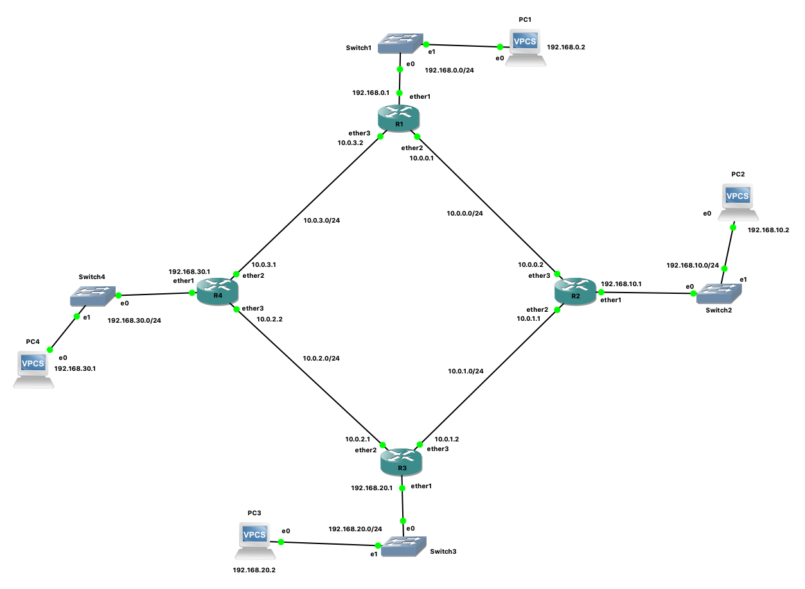

= Mikrotik

Als lector systemen en netwerken is er naast Cisco nog iets *anders* op de markt van netwerken en dat *anders* gaan we vandaag onderzoeken. Met vallen en opstaan!
We beginnen met Mikrotik

== Mikrotik CHR
In deze oefeningen gebruiken we https://wiki.mikrotik.com/wiki/Manual:CHR[Mikrotik CHR]. Dit is een Mikrotik virtuele router die bedoeld is om in een virtuele omgeving gebruikt te worden. We zullen deze router gebruiken in de GNS3 simulatiesoftware. 

== Statische Routes
We gaan volgend netwerk nabouwen in GNS3:

=== Router R1
    /system identity set name=R1
    /ip address
    add address=192.168.0.1/24 interface=ether1 network=192.168.0.0 
    add address=10.0.0.1/24    interface=ether2 network=10.0.0.0
    add address=10.0.3.2/24    interface=ether3 network=10.0.3.0
    /ip route
    add distance=1 dst-address=192.168.10.0/24 gateway=10.0.0.2
    add distance=1 dst-address=192.168.20.0/24 gateway=10.0.0.2
    add distance=1 dst-address=192.168.20.0/24 gateway=10.0.3.1
    add distance=1 dst-address=192.168.30.0/24 gateway=10.0.3.1

Check:
    ip add   print
    ip route print

=== Router R2
    /system identity set name=R2
    /ip address
    add address=192.168.10.1/24 interface=ether1 network=192.168.10.0 
    add address=10.0.1.1/24     interface=ether2 network=10.0.1.0
    add address=10.0.0.2/24     interface=ether3 network=10.0.0.0
    /ip route
    add distance=1 dst-address=192.168.0.0/24  gateway=10.0.0.1
    add distance=1 dst-address=192.168.20.0/24 gateway=10.0.1.2
    add distance=1 dst-address=192.168.30.0/24 gateway=10.0.0.1
    add distance=1 dst-address=192.168.30.0/24 gateway=10.0.1.2

Check:
    ip add   print
    ip route print

=== Router R3
    /system identity set name=R3
    /ip address
    add address=192.168.20.1/24 interface=ether1 network=192.168.20.0 
    add address=10.0.2.1/24     interface=ether2 network=10.0.2.0
    add address=10.0.1.2/24     interface=ether3 network=10.0.1.0
    /ip route
    add distance=1 dst-address=192.168.10.0/24 gateway=10.0.1.1
    add distance=1 dst-address=192.168.0.0/24  gateway=10.0.1.1
    add distance=1 dst-address=192.168.0.0/24  gateway=10.0.2.2
    add distance=1 dst-address=192.168.30.0/24 gateway=10.0.2.2

Check:
    ip add   print
    ip route print

=== Router R4
    /system identity set name=R4
    /ip address
    add address=192.168.30.1/24 interface=ether1 network=192.168.30.0 
    add address=10.0.3.1/24     interface=ether2 network=10.0.3.0
    add address=10.0.2.2/24     interface=ether3 network=10.0.2.0
    /ip route
    add distance=1 dst-address=192.168.0.0/24  gateway=10.0.3.2
    add distance=1 dst-address=192.168.10.0/24 gateway=10.0.3.2
    add distance=1 dst-address=192.168.10.0/24 gateway=10.0.2.1
    add distance=1 dst-address=192.168.20.0/24 gateway=10.0.2.1

Check:
    ip add   print
    ip route print

== Referentie
https://wiki.mikrotik.com/wiki/Manual:Simple_Static_Routing