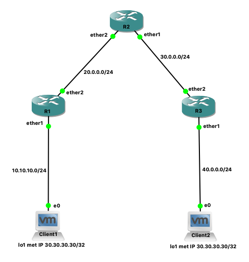
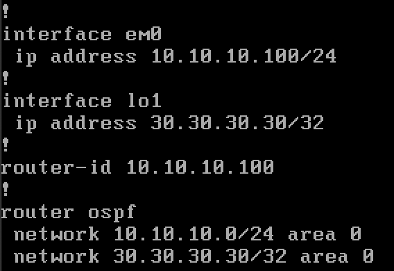
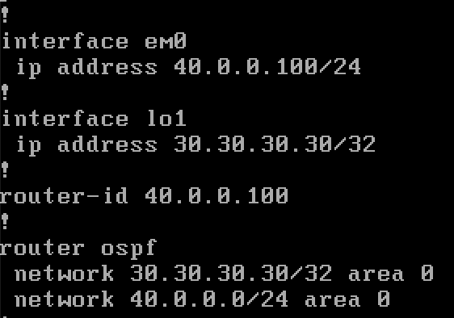

= IGP Anycast

Anycast is een "speciaal" effect van routeringsprotocollen. Als op twee verschillende plaatsen in het netwerk hetzelfde IP-adres terug te vinden is, zal vb. OSPF verschillende routes vinden tot deze plaatsen of IP-adressen in het netwerk. 

Neem onderstaand netwerk: 

== Router Configs

=== R1

    /ip address
    add address=10.10.10.2/24 interface=ether1 network=10.10.10.0
    add address=20.0.0.1/24 interface=ether2 network=20.0.0.0
    /routing ospf network
    add area=backbone network=10.10.10.0/24
    add area=backbone network=20.0.0.0/24
    /system identity
    set name=R1

=== R2

    /ip address
    add address=20.0.0.2/24 interface=ether2 network=20.0.0.0
    add address=30.0.0.1/24 interface=ether1 network=30.0.0.0
    /routing ospf network
    add area=backbone network=20.0.0.0/24
    add area=backbone network=30.0.0.0/24
    /system identity
    set name=R2

=== R3

    /ip address
    add address=40.0.0.2/24 interface=ether2 network=40.0.0.0
    add address=30.0.0.3/24 interface=ether1 network=30.0.0.0
    /routing ospf network
    add area=backbone network=40.0.0.0/24
    add area=backbone network=30.0.0.0/24
    /system identity
    set name=R3

== Client config
De clients draaien FreeBSD met frr:
* pkg install frr7
* touch /usr/local/etc/ffr/frr.conf
* service frr onestart
* vtysh [-f /usr/local/etc/ffr/frr.conf]

In frr sla je de config op met het commando `wr` cfr. Cisco routers. 

FreeBSD heeft standaard geen lo1. Deze creëer je met volgend commando `ifconfig lo1 create`.

=== Client 1

=== Client 2

== Controle
Om te controleren of "anycast" werkt zou:

* R1 het ip-adres 30.30.30.30/32 moeten vinden bij client 1
* R3 het ip-adres 30.30.30.30/32 moeten vinden bij client 2
* R2 het ip-adres 30.30.30.30/32 moeten vinden bij client 1 én client 2

    [admin@R2] > ip route print 
    Flags: X - disabled, A - active, D - dynamic, 
    C - connect, S - static, r - rip, b - bgp, o - ospf, m - mme, 
    B - blackhole, U - unreachable, P - prohibit 
    #      DST-ADDRESS        PREF-SRC        GATEWAY            DISTANCE
    0 ADo  10.10.10.0/24                      20.0.0.1                110
    1 ADC  20.0.0.0/24        20.0.0.2        ether2                    0
    2 ADC  30.0.0.0/24        30.0.0.1        ether1                    0
    3 ADo  30.30.30.30/32                     30.0.0.3                110
                                              20.0.0.1          
    4 ADo  40.0.0.0/24                        30.0.0.3                110
    [admin@R2] >

== Problemen
Let er wel zeer goed op dat de router-id's verschillend zijn op alle routers. Dit kan je controleren met volgend commando `/routing ospf neighbor print`.